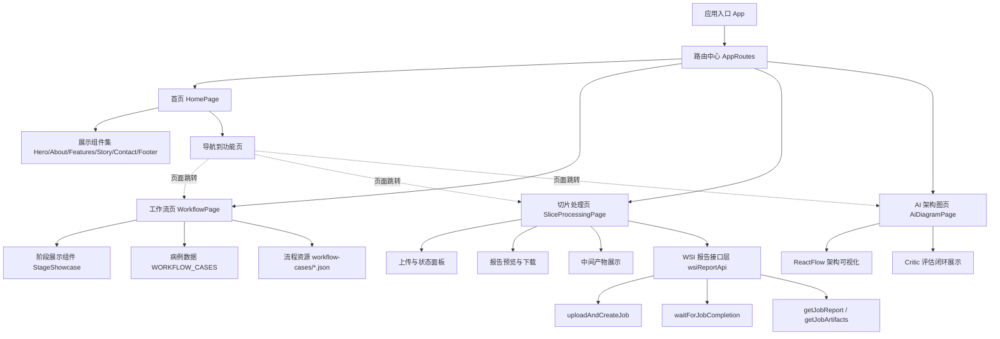

# 1.1 界面与功能说明

## 1.1.1 界面设计风格

本项目主页面采用“叙事型信息架构 + 任务导向交互”的设计思路，整体通过纵向模块化布局组织内容，从品牌引导、能力展示到流程认知逐层递进，使用户在一次完整浏览中即可建立对系统定位、应用场景与操作路径的整体理解。页面视觉语言以医学影像与智能分析场景为核心语境，强调专业性、可信度与可解释性，而非纯装饰化视觉表达。

在布局层面，主页面延续清晰的阅读顺序，采用大标题、短说明、关键模块分区的组合方式。各区块之间通过留白、边框、背景层次和字体权重形成稳定的信息层级，既保证了页面在桌面端的展示完整性，也便于在移动端保持阅读连贯。整体排版避免了复杂的跳转式结构，尽量将核心信息置于自然滚动路径中，以降低用户的理解成本。

在图标与界面符号设计方面，页面采用“轻图标化”的克制策略，重点使用步骤徽章、状态标识、链路箭头和功能按钮来传递语义。其中，步骤徽章用于标注流程阶段并强化顺序认知，状态色用于表达任务执行状态（如处理中、成功、失败），链路箭头用于呈现输入到输出的因果关系，下载与跳转按钮则承担结果交付和页面导航功能。该策略能够在不增加视觉噪声的前提下提升信息可读性，更符合病理分析平台对准确表达与专业呈现的要求。

在图像风格方面，页面以深色基底叠加渐变光晕和局部高亮，营造数据计算与智能推理的技术氛围；同时引入病理切片、流程节点和报告容器等业务相关视觉元素，确保界面“美观性”与“业务真实性”并重。动画设计主要用于阶段切换和重点聚焦，例如卡片渐显、内容过渡和局部强化，目的是引导视线而非制造干扰，从而提升操作效率与浏览体验。

## 1.1.2 主要功能页面

项目围绕“样本处理、流程演示、技术解释、入口导航”构建了四类主要功能页面，页面之间既可独立使用，也可形成完整的演示与操作闭环。

切片处理页面是系统的核心操作页面，采用工作台式布局：左侧负责文件上传、任务状态与日志跟踪，右侧负责报告预览与下载，下方集中展示中间产物与结构化结果。用户可通过点击或拖拽方式上传 WSI 文件，系统会自动创建异步任务并实时回传处理阶段、进度百分比与日志信息。任务完成后，用户可在线查看病理报告与推理报告 PDF，并按需下载；同时可查看高注意力 patch、相似 patch、诊断 JSON 及中间文件列表，用于结果复核与过程追踪。该页面的设计特色在于“过程透明、状态可见、结果可交付”，能够兼顾演示需求与实际业务操作需求。

工作流展示页面用于可视化呈现病理分析的全流程逻辑。页面通常采用“阶段导航 + 主舞台展示”的结构：导航区域负责显示当前所处阶段与整体进度，展示区域通过图像、卡片和过渡动画呈现每一步的核心内容，包括上传、分类、分块、相似检索和报告生成。用户可通过滚轮或阶段按钮完成步骤切换，并在关键阶段查看证据链条与关联说明。该页面的设计重点是“叙事连续性”和“阶段可解释性”，适合教学演示、业务汇报和方案讲解场景。

AI 架构图页面主要面向研发沟通与技术展示，使用可交互流程图呈现从输入切片到双报告输出的端到端推理架构。为避免信息过载，当前版本对后段生成链路做了简化，重点保留“报告生成 -> Critic 评估 -> 未达阈值回流 refine -> 达阈值后输出病理报告与诊断报告”的核心闭环逻辑。页面支持画布缩放、拖拽和平移，用户可按需放大局部节点查看模块职责与链路关系。该页面的特色在于重点突出、评估闭环清晰，能够有效支撑项目评审、技术对齐和对外说明。

首页作为统一入口页面，承担产品介绍与导航分发功能。其设计目标并非承载复杂操作，而是帮助用户快速建立“系统是做什么的、有哪些能力、下一步去哪里”的认知路径。用户可在首页完成基础理解后，进入切片处理页面执行任务，或进入工作流与架构图页面进行深入浏览。通过这一入口机制，项目形成了从认知、演示到实操的自然过渡。

综上，本项目的主要功能页面在设计上强调一致的视觉语言与清晰的任务路径，在交互上强调状态反馈与过程可解释，在内容上强调专业可信与结果可复核，能够较好满足病理智能分析场景下的展示与使用需求。

## 1.1.3 前端网页关系图

下图用于展示前端页面的路由关系、页面间跳转关系，以及页面与核心数据/接口层之间的连接方式。

